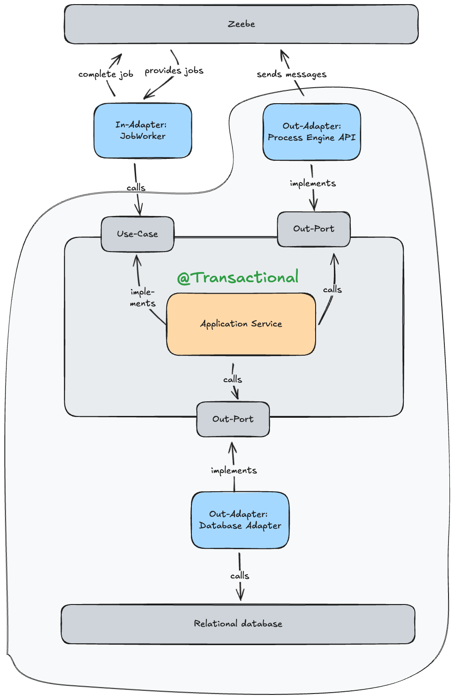
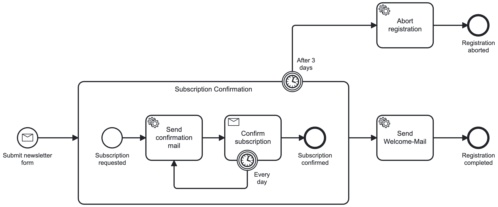
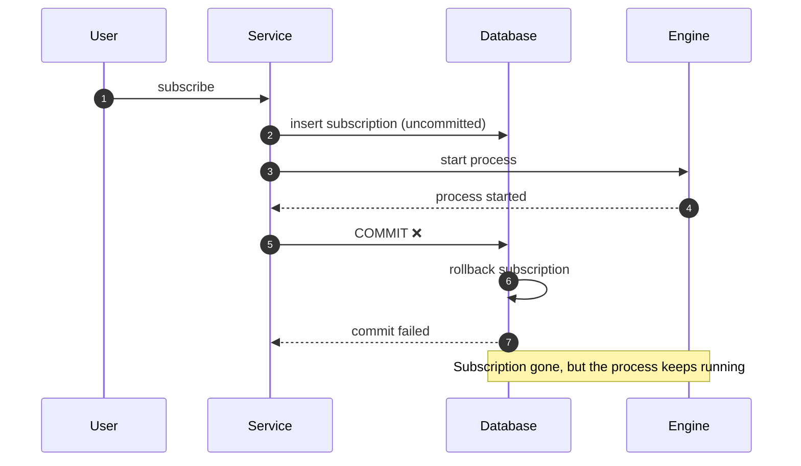

# 📘 Detailed Challenges of Distributed Transactions

Distributed transactions are a fundamental challenge in distributed systems architecture.
Whenever a single operation spans multiple independent systems—a database, a message broker, an external API, or a
process engine—you can no longer guarantee that all of them succeed or fail together. This opens the door to
inconsistent state.

This document explains the problem from the ground up: first the **general** distributed-transaction problem and the
shift from monolithic to distributed systems, then how it **specifically manifests when working with a remote process
engine** such as Zeebe (Camunda 8). It uses concrete examples, sequence diagrams, and a reference architecture to make
the failure modes tangible.

> ℹ️ **Not a Zeebe problem.** None of these challenges are unique to Zeebe, and none of them mean a remote engine is
> "worse" than an embedded one. They are the price of distribution—paid in exchange for scalability, resilience, and
> independent deployment. See [_Embedded vs. remote engines: a trade-off, not a flaw_](#embedded-vs-remote-engines-a-trade-off-not-a-flaw).

## 🎮 When Production Breaks: A Concrete Symptom

Imagine a newsletter platform whose subscription flow has run smoothly for months. Then support tickets start piling up:
_"I signed up but never received a confirmation email."_ When you investigate, you find a contradictory pattern—**there
is no subscription in the database**, yet **there is a running process instance** in the engine, stuck on an incident
that always reads the same: `NoSuchElementException`. The task that should send the confirmation email cannot find the
subscription it was told to work on.

The code looks correct. It saves the subscription and notifies the engine inside a single `@Transactional` method:

```kotlin
@Service
@Transactional
class SubscribeToNewsletterService(
    private val repository: NewsletterSubscriptionRepository,
    private val processPort: NewsletterSubscriptionProcess
) {
    fun subscribe(command: SubscribeToNewsletterUseCase.Command): SubscriptionId {
        val subscription = buildSubscription(command)
        repository.save(subscription)        // local database
        processPort.submitForm(subscription.id)  // remote engine
        return subscription.id
    }
}
```

The catch: `@Transactional` only controls the **local database** transaction. It has no power over the engine, which
runs as a separate system. So if the message reaches the engine but the database commit then fails, only the database
rolls back. The subscription disappears—but the process is already running, looking for data that no longer exists.

This is the **distributed transaction problem**, and that incident is its signature in your logs.

## 🌐 From Monolithic to Distributed

To understand why this problem catches teams off guard, it helps to look at where many of us come from: the
**monolithic, single-system world**.

For years, business logic, database access, and often the process engine itself lived together in one application,
writing to one database, protected by **one transaction per operation**. An embedded engine (e.g. Camunda 7 running as a
library) shared that same transaction. Same transaction meant same fate: either the subscription **and** the process
instance were saved, or neither was. This safety came from the **ACID** guarantees of a single database:

- **Atomicity** — a transaction either succeeds completely or fails completely.
- **Consistency** — every transaction moves the database from one valid state to another.
- **Isolation** — concurrent transactions don't see each other's uncommitted changes.
- **Durability** — once committed, changes survive failures.

### Even monoliths weren't fully safe

ACID never reached across the network. The moment a monolith called an email service, a message broker, or a REST API,
it left ACID's protection—because a local transaction can't roll back a remote side effect. The same distributed
transaction problem existed even then. It was simply **less visible**, because most operations stayed inside the system
and the engine was not part of the problem.

### Remote engines remove the safety net

With a remote engine like Zeebe, this changes by design. The engine becomes an external system you coordinate with over
the network, with its own database and its own commit decisions. The architecture now has **three independent pieces**:
your application + its database, the engine + its infrastructure, and the network in between.



What was once an _occasional_ problem—only when you deliberately integrated an external service—now applies to **every
single interaction** with your process engine. And the code looks almost identical, which is what makes it deceptive.
Beneath the surface, you no longer operate under ACID, but under **BASE**:

- **Basically Available** — the system stays operational during partial failures.
- **Soft State** — state may change over time as systems converge.
- **Eventual Consistency** — all systems reach the same state eventually, just not instantly.

BASE isn't a limitation—it's a **trade-off**. You exchange immediate, tightly-coupled consistency for systems that scale
and fail independently.

### Embedded vs. remote engines: a trade-off, not a flaw

It's tempting to conclude that embedded engines are "better" because they avoid these challenges. They aren't—they make
a different trade. Embedding _was_ an option with Camunda 7; with Zeebe it isn't. But the same challenges appear in C7
too the moment it runs as a separate service over the network. So **neither approach is inherently better or worse**.
A remote engine trades coordination complexity for scalability, resilience, and cloud-native deployment—benefits most
teams want. The point of this document is not to discourage remote engines, but to apply the right patterns so you keep
those benefits without the inconsistencies.

## ❌ The Universal Challenge

The core problem is simple to state: **when an operation spans multiple independent systems, you cannot guarantee they
all succeed or fail together.**

Within a single database, the database itself acts as a **transaction coordinator**: it locks resources, coordinates the
commit, and rolls everything back on error. Across system boundaries, **no such coordinator exists**. Each system commits
or rolls back on its own, with no mechanism to make them agree. So **partial success** becomes possible—one system
commits while the other fails—and there is no automatic way to repair the resulting inconsistency.

### Where this surfaces

This is not specific to process engines. The same challenge appears whenever you coordinate across independent systems:

- **Microservices & external APIs** — You mark a user as unsubscribed in your database and call an email provider to
  confirm it. The provider sends the email, but then your database commit fails. The user gets a confirmation email yet
  remains subscribed.
- **Event-driven systems & message queues** — A content system publishes a new edition to a publishing system via Kafka.
  The publishing system fails to persist it. The two systems now hold contradictory views of reality.
- **Remote process engines** — The case this repository focuses on, explored in detail below.

### The consequences

- **Data inconsistencies** — different systems hold contradictory views of reality.
- **Lost or partial operations** — work that should happen never happens, or only partially.
- **Duplicate operations** — retries meant to fix failures instead create duplicates (e.g. two confirmation emails).
- **Manual intervention** — without automatic recovery, humans must reconcile state, which doesn't scale.

## 🔮 In Context: Coordinating with a Remote Engine

When you adopt Zeebe, you build a distributed system: your application and the engine coordinate over the network, each
with its own database and independent commit decisions. The distributed transaction problem therefore affects **every
interaction**—every message you send and every job your workers complete.

Zeebe's design choices make this explicit, and they are intentional trade-offs that buy scalability and reliability:

- It uses **at-least-once delivery**—jobs and messages may be delivered more than once.
- It assumes workers can pick up and execute jobs **as soon as they are triggered**.
- It maintains **its own state**, independent of your database.

The failures that result cluster around the two moments when your application crosses the boundary: **when it sends
messages to the engine**, and **when workers acknowledge completed jobs**. The table below maps each challenge to the
pattern that addresses it.

| #   | Challenge                              | When it happens     | Addressed by                          |
|-----|----------------------------------------|---------------------|---------------------------------------|
| 1   | Phantom instance (process without data)| Sending messages    | After-Transaction, Outbox             |
| 2   | Premature execution: reading stale data| Sending messages    | After-Transaction, Outbox             |
| 3   | Premature execution: overwriting data  | Sending messages    | Outbox (ordered), process modeling    |
| 4   | Duplicate delivery                     | Both sides          | Idempotency (+ `messageId` short-term)|
| 5   | Job completion lost (connectivity)     | Acknowledging jobs  | Idempotency                           |
| 6   | Job no longer available (cancellation) | Acknowledging jobs  | Process modeling, compensation/Saga   |

### Example process: newsletter subscription

All examples use the same flow, implemented in a **hexagonal architecture** with transaction boundaries at the service
layer:

1. A user submits a subscription form.
2. The service saves the subscription in the database.
3. The service notifies the engine, which orchestrates tasks like sending a confirmation email and, after confirmation,
   a welcome email.



## 📤 Challenges When Sending Messages to the Engine

### 1. Phantom Instance: Process Runs Without Data 🚨

**The generic problem**: Notifying a dependent system before persisting state creates a race. If the notification
succeeds but persistence fails, the dependent system operates on data that doesn't exist.

**How it manifests**: The service sends the message to the engine, the engine starts the process immediately, and then
the database transaction **fails and rolls back**. The engine has a running instance, but the business data it needs is
gone—workers fail with errors like `NoSuchElementException`. This is the production symptom from the opening section.

> Addressed by **After-Transaction** (send only after commit) and the **Outbox** pattern (persist the message atomically,
> deliver it afterwards).


```mermaid
sequenceDiagram
    autonumber
    participant User
    participant Service
    participant DB as Database
    participant Engine
    User ->> Service: subscribe
    Service ->> DB: insert subscription (uncommitted)
    Service ->> Engine: start process
    Engine -->> Service: process started
    Service ->> DB: COMMIT ❌
    DB ->> DB: rollback subscription
    DB -->> Service: commit failed
    Note over DB, Engine: Subscription gone, but the process keeps running
```

### 2. Premature Execution: Reading Stale Data 🏃

**The generic problem**: Even when persistence eventually succeeds, a dependent system may act on the data **before** the
commit completes—a timing race.

**How it manifests**: The commit ultimately succeeds, but the engine assigns the first job before it does. The worker
queries for the subscription and finds nothing yet. Unlike the phantom instance, the data _will_ exist shortly—but the
worker reached it too early.

> Addressed by **After-Transaction** and the **Outbox** pattern—both guarantee the message is sent only _after_ the
> commit.

### 3. Premature Execution: Overwriting Data 🔀

**The generic problem**: Without ordering guarantees, concurrent operations can execute out of sequence and overwrite
each other.

**How it manifests**: A follow-up task commits its changes before a preceding task has finished—particularly damaging
when both write the same data. The result is corrupted state and race conditions that need manual resolution.

> Addressed by **ordered outbox processing** and by **process modeling** (splitting a task that touches multiple systems
> into separate, retryable steps).

## 📥 Challenges When Acknowledging Jobs

A worker can successfully process a job and commit its changes, yet fail to tell the engine it's done. What happens next
depends on _why_ the acknowledgment failed.

### 4. Duplicate Delivery 🔁

**The generic problem**: Distributed systems retry to handle transient failures, and many guarantee **at-least-once
delivery**—a message or job arrives, but possibly more than once. This is true of message brokers like Kafka and of the
Outbox pattern's own retries, not just Zeebe.

**How it manifests**: A job (or message) is delivered twice. Without protection, the side effect runs twice—two welcome
emails, a counter incremented by two, a double charge.

> Addressed by **idempotency** on the receiving side (a processed-operations log). Zeebe's `messageId` adds short-term
> deduplication while a message sits in the engine's buffer (its TTL, typically seconds)—useful against bursts of
> retries, but **not** long-term idempotency. See the
> [message uniqueness docs](https://docs.camunda.io/docs/components/concepts/messages/#message-uniqueness). Combine both.

### 5. Job Completion Failure: Connectivity Issues 🌐

**The generic problem**: A worker completes its work but can't notify the coordinator due to a network failure, leaving
uncertainty about whether the operation completed.

**How it manifests**: The worker sends the confirmation and commits to the database, but the "complete job" call fails on
the network. From the engine's perspective the job is still active, so it will **retry after a timeout**—delivering the
job again.

> Manageable with **idempotency**: the retry is safely skipped because the operation is already recorded.

### 6. Job Completion Failure: Task No Longer Available ⏳

**The generic problem**: Work assignments can be cancelled while in progress. A worker may finish, unaware the
coordinator already moved on, producing changes that now need compensation.

**How it manifests**: The job gets cancelled mid-processing—for example by an **interrupting boundary event** (a timer or
message) firing on the task or an enclosing subprocess. The worker finishes its database changes, but the job is no
longer active, so the engine rejects the completion. The engine never learns the work was done, leaving a permanent
inconsistency.

> Hardest to prevent. Mitigate through **process modeling**—prefer interrupting boundary events on elements with an
> explicit wait state (message-receive and user tasks), where _you_ control completion and can catch the rejection—and
> through **compensation / the Saga pattern** to explicitly undo work that has already happened.

---

> 💡 **Want the solutions?** Each challenge is solved by one or more patterns implemented in this repository. See the
> [main README](README.md) for the pattern catalog and runnable examples, and the
> [conceptual deep-dive blog post](https://medium.com/p/d4bbbca295d6) for the full narrative.
