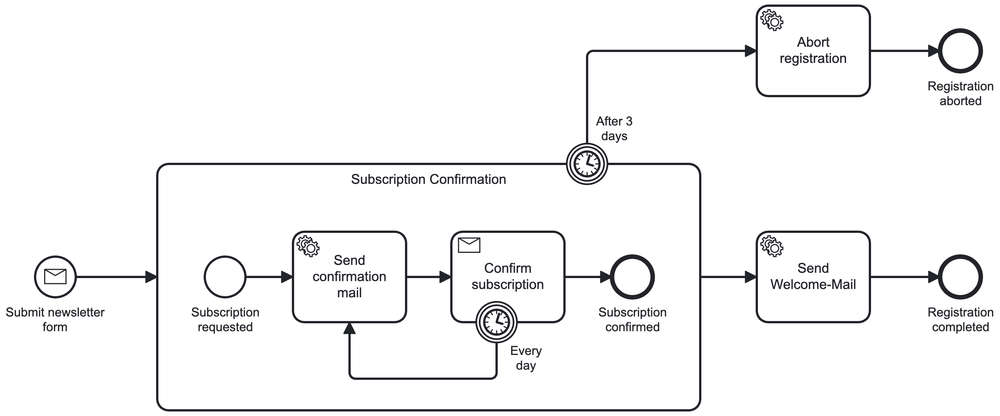

# 📘 Detailed Challenges in Process Automation with Zeebe

Distributed transactions are a fundamental challenge in distributed systems architecture.
When a single operation spans multiple independent systems—such as a database, a process engine, or external APIs—ensuring consistency becomes complex.
These challenges are not unique to Zeebe; they apply to any distributed system where state must be coordinated across boundaries.

This document explores these generic distributed system problems through the lens of process automation with Zeebe,
providing concrete examples, diagrams, and architectural perspectives to illustrate how these challenges manifest in practice.

## **Why Process Engines Face These Challenges** ⚙️

Process engines like Zeebe are themselves distributed systems designed for high availability, scalability, and fault tolerance.
As a distributed system, Zeebe manages its own state independently from your application's database,
which creates a **boundary** between two systems that must be kept synchronized.

### **The Core Challenge**

When your application interacts with Zeebe, you're coordinating state across two independent systems:
- **Your database**: Holds your business data (e.g., user subscriptions, orders, accounts)
- **The process engine**: Holds workflow state (e.g., which tasks are active, completed, or pending)

These systems operate asynchronously and can fail independently.
A database transaction might succeed while the message to Zeebe fails, or vice versa.
Without proper coordination mechanisms, this leads to **inconsistent state** across system boundaries.

### **Zeebe's Design Characteristics**

Zeebe assumes that tasks can execute as soon as they're triggered:
- It operates with **at-least-once delivery** semantics, meaning jobs may be delivered multiple times
- It's designed for **high throughput** and assumes workers can handle jobs immediately
- It maintains **its own state** independently from your application's database

These design choices are intentional and provide excellent scalability and reliability,
but they require your application to implement proper coordination patterns to maintain consistency.

### **A Concrete Example**

Let's examine these challenges through a **newsletter subscription process**,
which demonstrates how distributed transaction problems manifest in a real-world scenario.

## **Example Process: Newsletter Subscription** 📧

This process involves the following steps:

1. A user submits a subscription form.
2. The system saves the subscription data in a database.
3. The system notifies Zeebe to handle the process, triggering tasks like sending a confirmation email and updating
   subscription status.

Here’s the process diagram:



## **Architecture Overview** 🏗️

The newsletter subscription process is implemented in a **hexagonal architecture**.
Transactions are defined at the **service level**, which interacts with the database and the external process engine (
Zeebe) through well-defined ports.

The architecture ensures clear separation of concerns but introduces challenges
when the database and the process engine need to remain synchronized.

### **Architecture Diagram**:


### **How It Works**:

1. **Service Layer**: Contains the business logic and transaction handling.
2. **Database**: Stores subscription data.
3. **Process Engine**: Orchestrates tasks like sending emails and updating subscription statuses.

Here’s an example of how the service might look:

```kotlin
@Service
@Transactional
class SubscribeToNewsletterService(
    private val repository: NewsletterSubscriptionRepository,
    private val processPort: NewsletterSubscriptionProcess
) {
    override fun subscribe(command: SubscribeToNewsletterUseCase.Command): SubscriptionId {
        val subscription = buildSubscription(command)
        repository.save(subscription)
        processPort.submitForm(subscription.id)
        return subscription.id
    }
}
```

In this setup:

- The service saves subscription data to the database.
- It immediately notifies the process engine (via `submitForm`) to start the workflow.

However, this approach can lead to several challenges when database transactions and engine interactions are not
properly synchronized.

## **Challenges**

The following challenges represent common distributed systems problems that occur when coordinating state across independent systems.
Each challenge illustrates a specific failure mode and how it manifests in the context of process automation.

### **1. Premature Execution 🚨**

**The Generic Problem**: In distributed systems, notifying a dependent system before persisting state creates race conditions.
If the notification succeeds but persistence fails, the dependent system operates on non-existent or incomplete data.

**How It Manifests with Zeebe**: The process engine starts tasks **before your database transaction is committed**,
causing tasks to rely on uncommitted or incomplete data.

- **Example**: After submitting the subscription form, the engine starts a task to send a confirmation email. However,
  if the database transaction fails, the email task cannot find the subscription data.
- **Impact**: Tasks fail unexpectedly, requiring retries or manual intervention to recover.

#### **Process Flow**:


### **2. Out-of-Sync States: Engine Ahead of Service 🔄**

**The Generic Problem**: When coordinating multiple systems, partial failures can cause state divergence.
If system A successfully notifies system B, but then system A's operation fails, system B proceeds with an action
that should never have been triggered.

**How It Manifests with Zeebe**: If the database transaction fails **after notifying Zeebe**,
the engine continues executing tasks with outdated data.

- **Example**: A user confirms their subscription, triggering an update in the database and notifying Zeebe. If the
  database update fails, the engine still proceeds as though the subscription was updated.
- **Impact**: Zeebe's state advances while the database remains unchanged, creating inconsistencies.

### **3. Out-of-Sync States: Conflicting Data 🔁**

**The Generic Problem**: Distributed systems often process operations concurrently.
Without proper ordering guarantees, concurrent operations can execute out of sequence,
leading to race conditions, data corruption, or deadlocks.

**How It Manifests with Zeebe**: Tasks in the engine may start out of order, leading to overwrites or even deadlocks.

- **Example**: The process involves confirming a subscription and then sending a welcome email. If the email task
  executes before the confirmation task finishes, database updates may happen in the wrong order.
- **Impact**: Out-of-order tasks cause data conflicts or deadlocks, requiring manual fixes or complex rollback
  mechanisms.

### **4. Retry Behavior and Duplicate Calls 🔁**

**The Generic Problem**: Distributed systems often retry failed operations to handle transient failures.
Without idempotency mechanisms, retries can result in duplicate operations being processed multiple times,
leading to incorrect state or side effects.

**How It Manifests with Zeebe**: Distributed systems often retry failed tasks, but retries can result in duplicate operations if not handled properly.

- **Example**: A service retries sending a message to Zeebe due to a database timeout. Each retry generates duplicate
  messages in the engine.
- **Impact**: Duplicates create unnecessary operations, affecting system performance and reliability.

### **5. Job Completion Failure: Network Issues 🌐**

**The Generic Problem**: In asynchronous distributed systems, a worker may complete an operation successfully but fail to notify
the coordinator due to network failures. This creates uncertainty about whether the operation completed,
potentially leading to duplicate retries.

**How It Manifests with Zeebe**: Even if the worker completes a task successfully, network issues may prevent it from notifying Zeebe.

- **Example**: A worker sends a confirmation email but cannot mark the job as complete due to a network failure.
- **Impact**: The database is updated, but Zeebe's state remains incomplete, requiring manual intervention to sync
  states.

#### **Job Completion Flow**:


### **6. Job Completion Failure: Task No Longer Available ⏳**

**The Generic Problem**: In event-driven systems, work assignments can be cancelled or invalidated while in progress.
A worker may complete an operation unaware that the coordinator has already moved on,
resulting in unnecessary work or state changes that need compensation.

**How It Manifests with Zeebe**: A worker might complete a task after the engine has already canceled or invalidated it due to timers, cancellations, or
other intermediate events.

- **Example**: A worker updates a subscription, but a timer cancels the workflow before the task finishes.
- **Impact**: The worker's changes are unnecessary, creating mismatches and requiring rollback or compensating actions.
