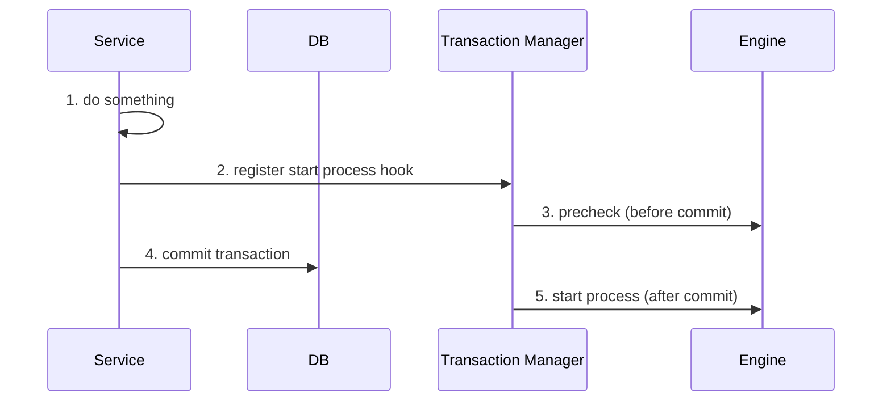

# ✅ After Transaction Example

This example demonstrates how to trigger Zeebe process engine interactions—such as sending messages or starting
processes—**only after a database transaction is successfully committed**. Using a custom transaction manager hook, we
ensure that interactions with Zeebe remain consistent with the database state.

## **Overview** 🛠️

The `ProcessTransactionManager` provided in this example hooks into Spring's transaction synchronization mechanism. It
allows you to register a callback for Zeebe interactions that will execute only **after the database transaction commits
**.

Here’s how it works:

1. **Transaction Check**: Verifies if a transaction is active.
2. **Precommit Check**: Ensures that the Zeebe brokers are healthy before committing the database transaction.
3. **Post-Commit Execution**: Sends the interaction command to Zeebe only after the database transaction is finalized.

> **📘 Please note:** The pre-commit hooks can never guarantee that the process-engine call will succeed.
> Their purpose is just to maximize the probability of a successful request

## **Code Example** 💻

Below is the implementation of the `ProcessTransactionManager`:

```kotlin
class ProcessTransactionManager(private val zeebeClient: ZeebeClient) {

    private val log = KotlinLogging.logger {}

    fun executeAfterCommit(processEngineCall: () -> Unit) {
        val isTransactionActive = TransactionSynchronizationManager.isActualTransactionActive()
        if (isTransactionActive) {
            log.debug { "Registering process engine call after commit" }
            registerEngineCallAfterCommit(processEngineCall)
        } else {
            processEngineCall()
        }
    }

    private fun registerEngineCallAfterCommit(
        processEngineCall: () -> Unit
    ) = TransactionSynchronizationManager.registerSynchronization(object : TransactionSynchronization {

        override fun afterCommit() = try {
            processEngineCall()
        } catch (e: Exception) {
            log.error(e) { "Manual action required. Failed to execute process engine call after commit" }
            throw e
        }

        override fun beforeCommit(readOnly: Boolean) {
            val topology = zeebeClient.newTopologyRequest().send().join()
            val healthy = checkBrokerHealth(topology)
            if (!healthy) throw IllegalStateException("No healthy broker found")
        }

        private fun checkBrokerHealth(topology: Topology): Boolean {
            return topology.brokers.any { brokerIsHealthy(it) }
        }

        private fun brokerIsHealthy(broker: BrokerInfo): Boolean {
            return broker.partitions.any { it.health == PartitionBrokerHealth.HEALTHY }
        }
    })
}
```

### **How to Use It**

1. Create an instance of `ProcessTransactionManager` with a configured `ZeebeClient`:
   ```kotlin
   val processTransactionManager = ProcessTransactionManager(zeebeClient)
   ```
2. Use the `executeAfterCommit` method to wrap your Zeebe interaction:
   ```kotlin
   processTransactionManager.executeAfterCommit {
       zeebeClient.newCreateInstanceCommand()
           .bpmnProcessId("my-process")
           .latestVersion()
           .send()
           .join()
   }
   ```

This ensures the interaction with Zeebe (e.g., sending a message or starting a process) happens **only after** the
database transaction is committed.

## **Sequence Flow** 📊

Here’s how the process works:



## **Advantages** 🎉

- **Consistency**: Ensures Zeebe interactions only occur after the database transaction succeeds.
- **Reliability**: Prevents Zeebe from progressing with uncommitted or inconsistent data.
- **Zeebe Health Check**: Verifies broker health before committing the transaction.
- **Fast Execution**: The engine call is executed directly after the transaction completes, without the latency of a
  scheduler or polling mechanism.
- **Simplicity**: The solution is straightforward to implement and easy to understand.

## **Downsides** ⚠️

- **No Post-Commit Retry Logic**:  
  If the post-commit call to Zeebe fails (e.g., due to a network issue or a broker crash), there is no retry mechanism.
  The database transaction will already be committed, but the interaction with Zeebe will not occur.

- **Error Handling Complexity**:  
  Any exceptions during the post-commit phase will require manual intervention. For instance, if the Zeebe call fails,
  logs will indicate that a manual action is required.

- **Performance Overhead**:  
  The broker health check before committing adds some latency to the transaction process.

- **Not Idempotent by Default**:  
  Ensure the Zeebe interaction is idempotent (able to handle duplicate invocations) to avoid issues in case of retries.

## **When to Use This Pattern?**

- **General Zeebe Interactions**: When sending messages, starting processes, or interacting with Zeebe, and ensuring
  database consistency is critical.
- **Time-Critical Cases**: When fast execution after transaction commit is required, and the latency of other
  solutions (like an outbox pattern with a scheduler) is not acceptable.
- **Zeebe Broker Validation**: When ensuring the Zeebe broker is healthy before proceeding is a priority.

## **Conclusion**

The `ProcessTransactionManager` provides a simple and effective way to synchronize database transactions with Zeebe
interactions. While it’s not a complete solution for all cases due to its downsides, it works well for scenarios
requiring fast, consistent, and straightforward interaction with Zeebe after a transaction.
