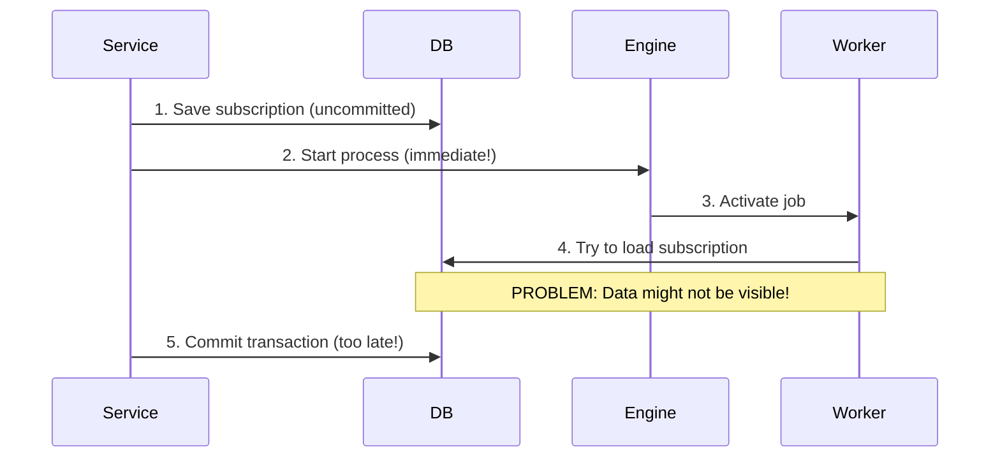

# ⚠️ Base Scenario (The Problem)

This example demonstrates **the distributed transaction problem** in its raw form, without any solution applied. This is the starting point that shows what can go wrong when coordinating database transactions with a process engine like Zeebe.

> **⚠️ WARNING**: This implementation is intentionally flawed to demonstrate the problems. Use the other examples (after-transaction or outbox-pattern) for production code.

## **Overview** 🛠️

In this base scenario, the service layer makes direct calls to Zeebe **within the same transaction** where database operations occur. This naive approach leads to several critical problems because the process engine starts executing tasks before the database transaction is committed, and may continue even if the transaction fails.

### **The Naive Implementation**

Here's what happens in this example:

```kotlin
@Service
@Transactional
class SubscribeToNewsletterService(
    private val repository: NewsletterSubscriptionRepository,
    private val processPort: NewsletterSubscriptionProcess
) : SubscribeToNewsletterUseCase {

    override fun subscribe(command: SubscribeToNewsletterUseCase.Command): SubscriptionId {
        val subscription = buildSubscription(command)
        repository.save(subscription)  // 1. Save to database (not committed yet!)
        processPort.submitForm(subscription.id)  // 2. Notify Zeebe immediately
        return subscription.id  // 3. Transaction commits after this
    }
}
```

The `NewsletterSubscriptionProcessAdapter` in this example calls Zeebe directly without any safety mechanisms:

```kotlin
@Component
class NewsletterSubscriptionProcessAdapter(
    private val camundaClient: CamundaClient
) : NewsletterSubscriptionProcess {

    override fun submitForm(id: SubscriptionId) {
        // PROBLEM: This call happens immediately, potentially before the DB commit!
        val variables = mapOf("subscriptionId" to id.value.toString())
        val allVariables = variables + mapOf("correlationId" to id.value.toString())
        camundaClient.newPublishMessageCommand()
            .messageName(Message_FormSubmitted)
            .withoutCorrelationKey()
            .variables(allVariables)
            .send()
            .join()
    }

    override fun confirmSubscription(id: SubscriptionId) {
        // PROBLEM: This call happens immediately, potentially before the DB commit!
        camundaClient.newPublishMessageCommand()
            .messageName(Message_SubscriptionConfirmed)
            .correlationKey(id.value.toString())
            .timeToLive(Duration.of(10, ChronoUnit.SECONDS))
            .send()
            .join()
    }
}
```

## **What Problems Does This Cause?** 🚨

### **1. Premature Execution**

The process engine starts tasks **before your database transaction is committed**.

- **Timeline**:
  1. Service saves subscription to database (uncommitted)
  2. Service notifies Zeebe to start process
  3. Zeebe immediately activates job for "Send Confirmation Mail"
  4. Worker picks up job and tries to load subscription from database
  5. **Problem**: Subscription data might not be visible yet (uncommitted)!

- **Result**: Workers fail because they can't find the data they need, requiring retries or manual intervention.

### **2. Out-of-Sync States: Engine Ahead of Database**

If the database transaction **fails after notifying Zeebe**, the process engine has already started but the database has no record.

- **Timeline**:
  1. Service saves subscription to database (uncommitted)
  2. Service notifies Zeebe (succeeds)
  3. Database transaction fails and rolls back
  4. **Problem**: Zeebe thinks the subscription exists, but database has nothing!

- **Result**: The process engine state is completely out of sync with the database.

### **3. Out-of-Sync States: Transaction Rollback After Success**

Even if both operations succeed individually, errors later in the transaction can roll back the database but not the process engine.

- **Timeline**:
  1. Service saves subscription to database (uncommitted)
  2. Service notifies Zeebe (succeeds)
  3. Service does additional operations
  4. Additional operation throws exception
  5. Spring rolls back entire transaction
  6. **Problem**: Database rolled back, but Zeebe already started!

- **Result**: Zeebe proceeds with a process that has no corresponding database record.

### **4. Race Conditions**

In high-throughput scenarios, workers may pick up jobs before the transaction commits, even if it eventually succeeds.

- **Problem**: The timing window between "notify Zeebe" and "commit transaction" creates a race condition.
- **Result**: Intermittent failures that are hard to reproduce and debug.

## **How to Observe These Problems** 🔬

### **Setup**
1. Start the infrastructure: `cd stack && docker-compose up`
2. Run this example application (port 8082)
3. Monitor Operate at http://localhost:9081 (credentials: demo/demo)

### **Reproduce Premature Execution**
1. Add a sleep or delay before the transaction commits (simulate slow commit)
2. Send a subscription request via Bruno or REST API
3. Observe in logs: Worker tries to load subscription before it's committed
4. See failed jobs in Operate

### **Reproduce Out-of-Sync States**
1. Inject a `RuntimeException` after the `processPort.submitForm()` call
2. Send a subscription request
3. Observe: Zeebe starts the process, but database transaction rolls back
4. Check Operate: Process instance exists with no database record

### **Compare with Other Solutions**
Run the same requests against:
- `after-transaction` example (port 8081) - See how transaction manager prevents issues
- `outbox-pattern` example (port different) - See how outbox provides reliability

## **Sequence Flow** 📊

Here's what happens in the base scenario:



## **Why This Matters** 💡

This base scenario represents a common mistake when integrating with external systems. Many developers intuitively write code this way without realizing the transaction boundaries and timing issues.

Understanding these problems is crucial because:
1. **They're subtle** - Often work fine in development but fail in production
2. **They're hard to debug** - Race conditions and timing-dependent failures
3. **They cause data inconsistency** - Database and process engine states drift apart
4. **They require proper solutions** - After-transaction hooks or outbox patterns

## **What Should You Use Instead?** ✅

This repository provides two battle-tested solutions:

1. **[After-Transaction Hook](../after-transaction/README.md)** ✅
   - Execute Zeebe calls only after database commit
   - Fast but no retry logic
   - Good for: Real-time requirements, simpler scenarios

2. **[Outbox Pattern](../outbox-pattern/README.md)** 📦
   - Store messages in database, send asynchronously
   - Reliable with retries
   - Good for: Mission-critical operations, eventual consistency acceptable

## **Conclusion**

This base scenario intentionally demonstrates the distributed transaction problem. **Never use this approach in production.** Instead, use one of the proven patterns demonstrated in the other examples, which properly handle the coordination between database transactions and process engine interactions.

For a detailed explanation of all the challenges, see [challanges.md](../../challanges.md) in the repository root.
