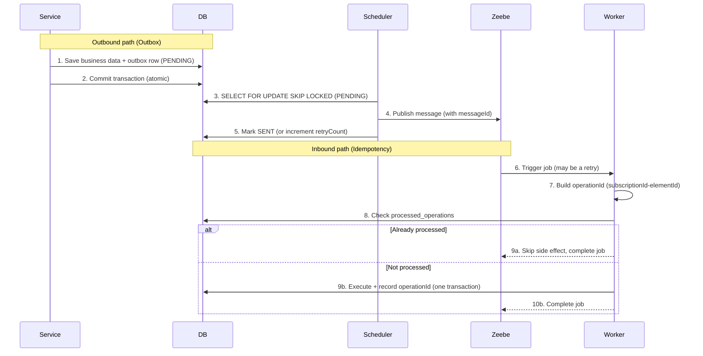

# 🛡️ Combined Pattern Example (Outbox + Idempotency)

This example combines the [**Outbox Pattern**](../outbox-pattern/README.md) and the
[**Idempotency Pattern**](../idempotency-pattern/README.md) into a single, production-grade setup. Each pattern
on its own only covers one direction of the boundary between your application and Zeebe. Together they make the
whole round-trip safe:

- **Outbox** secures the **outgoing** path (service → Zeebe): messages are written to a database table inside the
  business transaction and delivered reliably by a scheduler with retries and `messageId` deduplication.
- **Idempotency** secures the **incoming** path (Zeebe → service): job workers record completed operations so that
  Zeebe's at-least-once retries never execute the same work twice.

The result addresses the full spectrum of distributed-transaction problems described in
[CHALLENGES.md](../../CHALLENGES.md).

## **Why Combine Them?** 🤔

A remote process engine like Zeebe manages its own state, independent of your database. Keeping the two in sync
requires solving problems on **both** sides of the boundary:

| Direction | Problem | Solved by |
|-----------|---------|-----------|
| Service → Zeebe | Premature execution, out-of-sync states, conflicting data (#1, #2, #3) | **Outbox** |
| Zeebe → Service | Duplicate job executions from retries (#4) | **Idempotency** |
| Service → Zeebe | Lost / duplicate message delivery (#5, #6) | **Outbox retries + `messageId` dedup** |

Neither pattern alone is enough for a real system. The outbox guarantees a message *eventually* reaches Zeebe even
if delivery fails; idempotency guarantees that the worker triggered by that message runs its side effects exactly
once even if it is retried.

## **Overview** 🛠️

The example uses the same newsletter subscription process as the other examples and wires the two mechanisms
together:

1. **Outbound (Outbox)** — `ProcessMessagePersistenceAdapter` implements the `NewsletterSubscriptionProcess` port
   and writes a `PENDING` row into the `process_message` table inside the service transaction. The
   `ProcessEngineOutboxScheduler` polls every 200ms, sends messages to Zeebe with a unique `messageId`, and marks
   them `SENT` (or increments `retryCount` on failure).
2. **Inbound (Idempotency)** — every job worker builds a composite `OperationId` (`subscriptionId-elementId`) and
   the services apply the **Check → Execute → Record** pattern against the `processed_operations` table, all inside
   one `@Transactional` boundary.

Because both the business data **and** the outbox message are persisted in the same transaction, they commit
atomically — the engine is never notified about data that was rolled back.

## **Code Example** 💻

### **Outbound: Writing to the Outbox in the Service Transaction**

The service stores the subscription and the outbox message in a single transaction:

```kotlin
@Service
@Transactional
class SubscribeToNewsletterService(
    private val repository: NewsletterSubscriptionRepository,
    private val processPort: NewsletterSubscriptionProcess, // -> ProcessMessagePersistenceAdapter
) : SubscribeToNewsletterUseCase {

    override fun subscribe(command: SubscribeToNewsletterUseCase.Command): SubscriptionId {
        val subscription = buildSubscription(command)
        repository.save(subscription)           // business data
        processPort.submitForm(subscription.id) // outbox row (status = PENDING) - same transaction
        return subscription.id
    }
}
```

The scheduler delivers the message reliably and uses a `messageId` so Zeebe deduplicates retries within the TTL:

```kotlin
private fun sendMessage(message: ProcessMessageEntity) {
    val variables = objectMapper.readValue(message.variables, object : TypeReference<Map<String, Any>>() {})
    val messageId = "${message.correlationId}-${message.messageName}"
    camundaClient.newPublishMessageCommand()
        .messageName(message.messageName)
        .correlationKey(message.correlationId)
        .messageId(messageId)                       // engine-level deduplication
        .variables(variables)
        .timeToLive(Duration.of(10, ChronoUnit.SECONDS))
        .send()
        .join()
}
```

### **Inbound: Idempotent Workers**

Workers construct the composite `OperationId`; the service checks it before doing any work:

```kotlin
@JobWorker(type = ServiceTasks.NEWSLETTER_SEND_WELCOME_MAIL)
fun sendWelcomeMail(job: ActivatedJob, @Variable("subscriptionId") subscriptionId: String) {
    useCase.sendWelcomeMail(
        SubscriptionId(UUID.fromString(subscriptionId)),
        OperationId("$subscriptionId-${job.elementId}"),
    )
}
```

```kotlin
@Service
@Transactional
class SendWelcomeMailService(
    private val repository: NewsletterSubscriptionRepository,
    private val processedOperationRepository: ProcessedOperationRepository,
) : SendWelcomeMailUseCase {

    override fun sendWelcomeMail(subscriptionId: SubscriptionId, operationId: OperationId) {
        if (processedOperationRepository.existsById(operationId)) return // already done -> skip
        val subscription = repository.find(subscriptionId)
        log.info { "Sending welcome mail to ${subscription.email}" }      // execute
        processedOperationRepository.save(operationId)                    // record
    }
}
```

## **Sequence Flow** 📊



## **Advantages** 🎉

- **Guaranteed delivery**: Messages survive failures via the outbox and are retried until sent.
- **No duplicate execution**: Idempotency checks plus `messageId` deduplication prevent double side effects.
- **Transactional consistency**: Business data and outbox message commit all-or-nothing.
- **Resilience**: Tolerates database failures, network issues, and Zeebe retries on both sides of the boundary.

## **Downsides** ⚠️

- **More moving parts**: A scheduler, an outbox table, and a `processed_operations` table to operate and monitor.
- **Latency**: The 200ms polling interval adds a small delay before messages reach Zeebe.
- **Table growth**: Both `process_message` (SENT rows) and `processed_operations` grow over time and need a cleanup
  strategy.
- **Unbounded retries**: Failing messages are retried indefinitely; add a max-retry / dead-letter strategy for
  production.

## **When to Use This Pattern?**

Use the combined pattern for **production systems** that need end-to-end safety: reliable delivery to Zeebe *and*
protection against duplicate job execution. If you only need one side of the guarantee, the standalone
[Outbox](../outbox-pattern/README.md) or [Idempotency](../idempotency-pattern/README.md) examples are simpler.

## **Conclusion**

The combined pattern is the natural production setup: the **Outbox** guarantees that every message reliably reaches
Zeebe as part of the business transaction, while **Idempotency** guarantees that the work triggered by those
messages happens exactly once. Together they close all six distributed-transaction challenges in a single,
consistent example.
