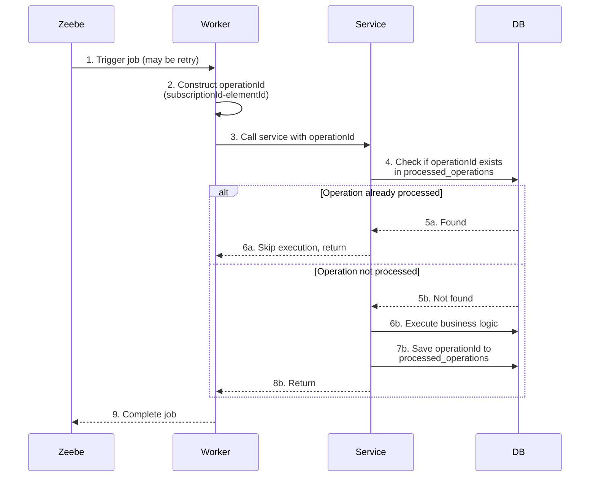

# 🔁 Idempotency Pattern Example

This example demonstrates how to handle **duplicate job worker executions** using an idempotency pattern. Zeebe uses at-least-once delivery semantics, meaning job workers may be invoked multiple times for the same job. This pattern tracks completed operations in a database table to prevent duplicate processing.

By checking if an operation has already been completed before executing business logic, this approach ensures that retried jobs don't cause duplicate side effects like sending emails multiple times or double-processing transactions.

## **Overview** 🛠️

The idempotency pattern consists of three main components:

1. **OperationId Value Object**: A composite key combining `subscriptionId-elementId` for business-driven idempotency tracking
2. **ProcessedOperations Table**: Database table that records completed operations with their operationId and timestamp
3. **Service Layer Check**: Services verify if an operation has been processed before executing business logic

**Key Features:**

- **Composite OperationId**: Uses `subscriptionId-elementId` instead of internal job keys for meaningful tracking
- **Service-Layer Implementation**: Idempotency logic lives in services, not workers (clean separation of concerns)
- **Atomic Pattern**: Check → Execute → Record happens in single `@Transactional` boundary
- **Minimal Infrastructure**: Just a simple database table, no schedulers or background processes needed

> **📘 Please note:** This pattern addresses **duplicate job executions** (problem #4 from distributed transaction challenges). It does NOT solve transaction coordination issues between your database and Zeebe. Combine this with After-Transaction or Outbox patterns for complete transaction safety.

## **Code Example** 💻

### **OperationId Value Object**

The `OperationId` wraps a composite key for type-safe operation tracking:

```kotlin
package de.emaarco.example.domain

data class OperationId(val value: String)
```

### **ProcessedOperation Entity**

The database entity tracks completed operations:

```kotlin
@Entity
@Table(name = "processed_operations")
data class ProcessedOperationEntity(
    @Id
    @Column(name = "operation_id", nullable = false)
    val operationId: String,

    @Column(name = "processed_at", nullable = false)
    val processedAt: Instant = Instant.now()
)
```

### **Service Layer Implementation**

Services implement the Check → Execute → Record pattern:

```kotlin
@Service
@Transactional
class SendConfirmationMailService(
    private val repository: NewsletterSubscriptionRepository,
    private val processedOperationRepository: ProcessedOperationRepository
) : SendConfirmationMailUseCase {

    private val log = KotlinLogging.logger {}

    override fun sendConfirmationMail(subscriptionId: SubscriptionId, operationId: OperationId) {
        if (processedOperationRepository.existsById(operationId.value)) {
            log.info { "Skipping already processed operation: ${operationId.value}" }
            return
        }

        val subscription = repository.find(subscriptionId)
        log.info { "Sending confirmation mail to ${subscription.email}" }

        processedOperationRepository.save(operationId.value)
    }
}
```

**Pattern Breakdown:**
1. **Check**: Query `processed_operations` table for the operationId
2. **Execute**: If not found, run the business logic (send email)
3. **Record**: Save the operationId to mark completion

All three steps happen atomically within the `@Transactional` boundary, preventing race conditions.

### **Worker Layer**

Workers construct the composite operationId and delegate to services:

```kotlin
@Component
class SendConfirmationMailWorker(
    private val useCase: SendConfirmationMailUseCase
) {
    private val log = KotlinLogging.logger {}

    @JobWorker(type = "newsletter.sendConfirmationMail")
    fun sendConfirmationMail(
        job: ActivatedJob,
        @Variable("subscriptionId") subscriptionId: String
    ) {
        log.debug { "Received Zeebe job to send confirmation mail: $subscriptionId" }
        useCase.sendConfirmationMail(
            SubscriptionId(UUID.fromString(subscriptionId)),
            OperationId("$subscriptionId-${job.elementId}")
        )
    }
}
```

**Composite OperationId Construction:**
- Format: `subscriptionId-elementId`
- Example: `550e8400-e29b-41d4-a716-446655440000-Activity_SendConfirmationMail`
- Business-driven: Tied to domain entity (subscription) and BPMN element, not internal Zeebe job keys

## **Sequence Flow** 📊

Here's how the idempotency pattern works:



**Important**: All steps within the Service (check, execute, record) happen in a single database transaction, ensuring atomicity.

## **Advantages** 🎉

- **Prevents Duplicate Processing**: Handles Zeebe's at-least-once delivery safely
- **Business-Driven Keys**: OperationId based on domain entities + BPMN elements, not internal job IDs
- **Clean Architecture**: Idempotency logic in services, workers stay thin
- **Atomic Pattern**: Check-execute-record happens in single transaction (no race conditions)
- **Simple Infrastructure**: Just a database table, no schedulers or message queues
- **Audit Trail**: `processed_at` timestamp provides history of when operations completed
- **Type Safety**: `OperationId` value object prevents string mistakes

## **Downsides** ⚠️

- **Limited Scope**: Only prevents duplicate worker executions, doesn't solve transaction coordination issues
- **Table Growth**: Every job execution creates a database entry
- **Cleanup Required**: Need strategy to archive/delete old entries (no automatic cleanup)
- **Not a Full Solution**: Must be combined with After-Transaction or Outbox patterns for complete safety
- **Performance Impact**: Additional database query per job execution
- **Memory Overhead**: processed_operations table can grow large in high-throughput systems

## **When to Use This Pattern?**

**Use this pattern when:**
- You're experiencing duplicate emails, notifications, or other side effects from Zeebe retries
- You need operation-level deduplication tied to business entities
- You want simple, database-backed idempotency without complex infrastructure
- You're combining with After-Transaction or Outbox patterns and need worker-level safety

**Don't use this pattern when:**
- You only need transaction coordination (use After-Transaction or Outbox instead)
- Your operations are naturally idempotent (no need for tracking)
- You can't afford the performance cost of extra database queries
- Table growth is a concern and you can't implement cleanup

## **Complementary Patterns**

This pattern works best **in combination** with other patterns:

| Pattern Combination | What It Solves |
|---------------------|----------------|
| **Idempotency only** | ❌ Duplicate workers, ❌ Transaction coordination issues |
| **After-Transaction + Idempotency** | ✅ Transaction safety + ✅ Duplicate prevention |
| **Outbox + Idempotency** | ✅ Reliable delivery + retries + ✅ Duplicate prevention |

**Recommended**: Use Idempotency Pattern with either After-Transaction or Outbox Pattern for production systems.

## **Conclusion**

The idempotency pattern provides a straightforward mechanism for preventing duplicate processing when Zeebe retries job workers. By tracking completed operations in a database table and implementing the Check → Execute → Record pattern at the service layer, you ensure that retried jobs don't cause duplicate side effects.

While it doesn't solve transaction coordination issues on its own, it's an essential complement to After-Transaction or Outbox patterns, providing defense-in-depth against duplicate processing in distributed systems.
