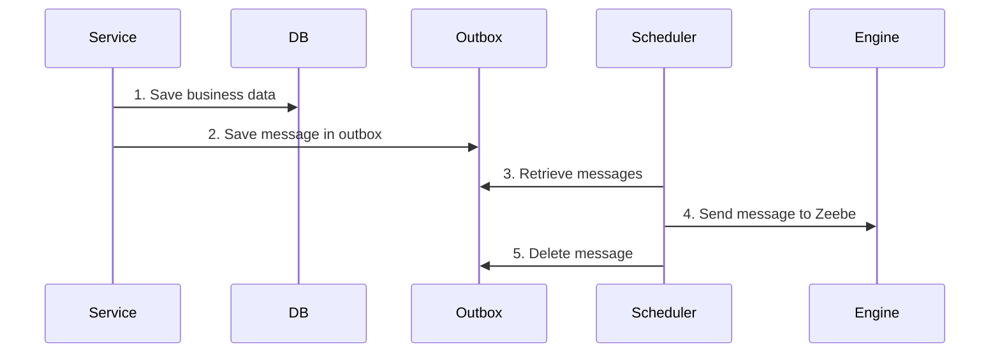

# 📦 Outbox Pattern Example

This example demonstrates how to reliably send messages to the Zeebe process engine by using an **outbox pattern**.
Messages are stored in a database during the main transaction, and a scheduler periodically processes the outbox to send
the messages to Zeebe.

By decoupling message creation from message sending, this approach introduces a **retry mechanism** to handle transient
failures and ensures message delivery consistency.

## **Overview** 🛠️

The outbox pattern consists of two main components:

1. **Message Storage**: Messages are stored in a database table as part of the same transaction that triggers the event.
2. **Message Sender (Scheduler)**: A periodic scheduler processes the messages in the outbox, sending them to Zeebe and
   removing them from the database upon success.

> **📘 Please note:** While this pattern introduces retry logic,
> it does not guarantee that messages can be sent to the engine,
> and are sent in the correct order.
> Messages are currently retrieved using `findAll` and sorted by creation time,
> which works in simple cases but may require additional ordering logic for more complex scenarios.

## **Code Example** 💻

### **Storing Messages in the Outbox**

The `NewsletterSubscriptionProcessAdapter` stores messages in the outbox table during the transaction:

```kotlin
@Component
class NewsletterSubscriptionProcessAdapter(
    private val repository: ProcessMessageJpaRepository,
) : NewsletterSubscriptionProcess {

    private val objectMapper = ObjectMapper()

    override fun submitForm(id: SubscriptionId) {
        val variables = mapOf("subscriptionId" to id.value.toString())
        val processMessage = ProcessMessageEntity(
            messageName = MESSAGE_FORM_SUBMITTED,
            correlationId = null,
            variables = objectMapper.writeValueAsString(variables),
        )
        repository.save(processMessage)
    }

    override fun confirmSubscription(id: SubscriptionId) {
        val variables = mapOf("subscriptionId" to id.value.toString())
        val processMessage = ProcessMessageEntity(
            messageName = MESSAGE_RECEIVE_CONFIRMATION,
            correlationId = null,
            variables = objectMapper.writeValueAsString(variables),
        )
        repository.save(processMessage)
    }
}
```

Here:

- **`ProcessMessageEntity`** represents the outbox table entry, which includes:
    - `messageName`: The name of the message to be sent to Zeebe.
    - `correlationId`: An optional correlation key for Zeebe.
    - `variables`: Process variables serialized as JSON.

Messages are saved to the database as part of the service's transaction, ensuring they are only created if the
transaction succeeds.

### **Sending Messages with the Scheduler**

The `ProcessEngineOutboxScheduler` processes messages from the outbox periodically:

```kotlin
@Component
class ProcessEngineOutboxScheduler(
    private val engineApi: ProcessEngineApi,
    private val repository: ProcessMessageJpaRepository,
) {

    private val log = KotlinLogging.logger {}
    private val objectMapper = ObjectMapper()

    @Scheduled(fixedRate = 10000) // Runs every 10 seconds
    fun sendMessages() {
        log.info { "Running scheduler to send messages to Zeebe" }
        val messages = repository.findAll()
        messages.sortBy { it.createdAt } // Sort messages by creation time
        messages.forEach { message ->
            sendMessage(message)
            repository.delete(message) // Remove message after successful processing
            repository.flush()
        }
    }

    private fun sendMessage(message: ProcessMessageEntity) {
        val variables = objectMapper.readValue(message.variables, object : TypeReference<Map<String, Any>>() {})
        engineApi.sendMessage(
            messageName = message.messageName,
            correlationId = message.correlationId,
            variables = variables,
        )
    }
}
```

Here:

- **Scheduler Frequency**: The `@Scheduled` annotation ensures the scheduler runs at a fixed interval (e.g., every 10
  seconds).
- **Message Sorting**: Messages are sorted by their creation time before processing, but this does not guarantee order
  correctness in all scenarios.
- **Message Deletion**: After successfully sending a message to Zeebe, it is deleted from the database.

## **Sequence Flow** 📊

Here’s how the outbox pattern works:



## **Advantages** 🎉

- **Consistency**: Decouples message creation and sending, ensuring messages are stored reliably as part of the main
  transaction.
- **Retry Logic**: If a message fails to send, the scheduler will attempt to send it in the next run.
- **Decoupling**: Sending messages is not tied to the main service logic, reducing coupling and improving scalability.
- **Simplicity**: The implementation is straightforward and relies on standard database and scheduler tools.

## **Downsides** ⚠️

- **No Guaranteed Order**:  
  Messages are processed in creation time order (`createdAt`), but this may not be sufficient for complex workflows that
  require strict ordering.

- **Latency**:  
  Messages are only sent during the next scheduler run, introducing a delay between message creation and processing.

- **Error Handling Complexity**:  
  If a message consistently fails to send (e.g., invalid message data), manual intervention is required to fix or remove
  it.

## **When to Use This Pattern?**

- **Message Reliability**: When ensuring that every message is reliably sent to Zeebe is a top priority, even in the
  event of temporary failures.
- **Retry Requirements**: When transient failures are expected, and a retry mechanism is needed to handle them.
- **Loosely Coupled Systems**: When decoupling the service's main logic from Zeebe interaction is desired.
- **Time-Insensitive Scenarios**: When a slight delay in message processing (due to the scheduler) is acceptable.

## **Conclusion**

The outbox pattern provides a robust mechanism for ensuring reliable message delivery to Zeebe. It introduces retry
logic, decouples message creation from processing, and provides flexibility for handling transient failures. While it
has limitations like potential latency and lack of guaranteed message order, it is a solid choice for many distributed
systems.
