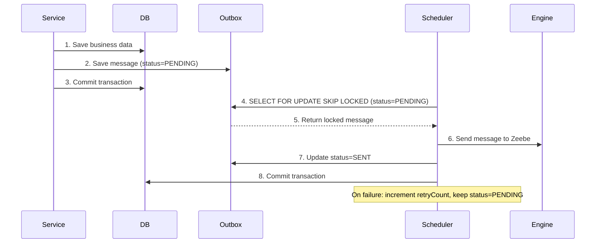

# 📦 Outbox Pattern Example

This example demonstrates how to reliably send messages to the Zeebe process engine by using an **outbox pattern**.
Messages are stored in a database during the main transaction, and a scheduler periodically processes the outbox to send
the messages to Zeebe.

By decoupling message creation from message sending, this approach introduces a **retry mechanism** to handle transient
failures and ensures message delivery consistency.

## **Overview** 🛠️

The outbox pattern consists of two main components:

1. **Message Storage**: Messages are stored in a database table with `status=PENDING` as part of the same transaction
   that triggers the event.
2. **Message Sender (Scheduler)**: A fast periodic scheduler (200ms interval) processes messages one-at-a-time using
   pessimistic locking, sending them to Zeebe and marking them as `SENT`.

**Key Features:**

- **Status Tracking**: Messages transition from `PENDING` → `SENT`
- **Automatic Retries**: Failed messages are retried with retry count tracking
- **Concurrent Scheduler Support**: Uses `SELECT FOR UPDATE SKIP LOCKED` to allow multiple scheduler instances
- **Audit Trail**: Sent messages remain in the database for historical tracking

> **📘 Please note:** This pattern provides **at-least-once delivery** semantics. Messages may be sent multiple times
> if a failure occurs after sending but before marking as SENT. Your process must be idempotent to handle duplicate
> messages safely.
>
> Message ordering is based on creation time and may not guarantee strict ordering in all scenarios,
> especially with concurrent schedulers or retries. Consider additional ordering logic for complex workflows.

## **Code Example** 💻

### **Storing Messages in the Outbox**

The `ProcessMessagePersistenceAdapter` stores messages in the outbox table during the transaction:

```kotlin
@Component
class ProcessMessagePersistenceAdapter(
    private val repository: ProcessMessageJpaRepository,
) : NewsletterSubscriptionProcess {

    private val objectMapper = ObjectMapper()

    override fun submitForm(id: SubscriptionId) {
        val variables = mapOf("subscriptionId" to id.value.toString())
        val processMessage = toProcessMessage(
            Message_FormSubmitted,
            id.value.toString(),
            variables
        )
        repository.save(processMessage)
    }

    override fun confirmSubscription(id: SubscriptionId) {
        val variables = mapOf("subscriptionId" to id.value.toString())
        val processMessage = toProcessMessage(
            Message_SubscriptionConfirmed,
            id.value.toString(),
            variables
        )
        repository.save(processMessage)
    }

    private fun toProcessMessage(
        messageName: String,
        correlationId: String?,
        variables: Map<String, Any>,
    ) = ProcessMessageEntity(
        messageName = messageName,
        correlationId = correlationId,
        variables = objectMapper.writeValueAsString(variables),
    )
}
```

Here:

- **`ProcessMessageEntity`** represents the outbox table entry, which includes:
    - `messageName`: The name of the message to be sent to Zeebe.
    - `correlationId`: An optional correlation key for Zeebe.
    - `variables`: Process variables serialized as JSON.
    - `status`: Current message status (PENDING or SENT).
    - `retryCount`: Number of send attempts (for retry tracking).
    - `createdAt`/`updatedAt`: Timestamps for ordering and tracking.

Messages are saved to the database with `status = PENDING` as part of the service's transaction, ensuring they are only
created if the transaction succeeds.

### **Sending Messages with the Scheduler**

The `ProcessEngineOutboxScheduler` processes messages from the outbox using a **one-at-a-time** approach with
pessimistic locking:

```kotlin
@Component
class ProcessEngineOutboxScheduler(
    private val engineApi: ProcessEngineApi,
    private val transactionManager: PlatformTransactionManager,
    private val repository: ProcessMessageJpaRepository,
) {

    private val log = KotlinLogging.logger {}
    private val objectMapper = ObjectMapper()

    @Scheduled(fixedDelay = 200) // Runs every 200ms
    fun sendMessages() {
        log.debug { "Running scheduler to send messages to zeebe" }
        var messagesProcessed = 0
        while (processNextMessage()) messagesProcessed++
        log.debug { "Scheduler finished. Processed $messagesProcessed messages" }
    }

    /**
     * Processes a single message within a transaction using pessimistic locking.
     * Returns true if a message was processed, false if no messages are available.
     */
    private fun processNextMessage() = performInTransaction {
        val message = repository.findFirstByStatusWithLock(MessageStatus.PENDING)
        if (message == null) {
            false
        } else {
            trySendMessage(message)
            true
        }
    }

    private fun trySendMessage(message: ProcessMessageEntity) {
        try {
            sendMessage(message)
            val sentMessage = message.copy(status = MessageStatus.SENT)
            repository.save(sentMessage)
            log.info { "Successfully sent message ${message.messageName}" }
        } catch (e: Exception) {
            val retryCount = message.retryCount + 1
            val retryMessage = message.copy(retryCount = retryCount)
            repository.save(retryMessage)
            log.warn(e) { "Retrying message ${message.messageName} (attempt $retryCount)" }
        }
    }

    private fun sendMessage(message: ProcessMessageEntity) {
        val variables = objectMapper.readValue(message.variables, object : TypeReference<Map<String, Any>>() {})
        engineApi.sendMessage(
            messageName = message.messageName,
            correlationId = message.correlationId,
            variables = variables,
        )
    }

    private fun <T> performInTransaction(block: () -> T): T {
        val template = TransactionTemplate(transactionManager)
        return template.execute { block() } ?: throw IllegalStateException("Transaction failed")
    }
}
```

**Key Implementation Details:**

- **Scheduler Frequency**: Runs every **200ms** using `fixedDelay` (ensures previous run completes before next starts).
- **One-at-a-Time Processing**: Uses a `while` loop to process messages one by one, stopping when no more PENDING
  messages exist.
- **Pessimistic Locking**: `findFirstByStatusWithLock()` uses `SELECT FOR UPDATE SKIP LOCKED`, allowing multiple
  scheduler instances to run concurrently without conflicts.
  ```kotlin
  @Lock(LockModeType.PESSIMISTIC_WRITE)
  @QueryHints(QueryHint(name = "jakarta.persistence.lock.timeout", value = "0"))
  @Query("SELECT m FROM process_message m WHERE m.status = :status ORDER BY m.createdAt ASC")
  fun findFirstByStatusWithLock(status: MessageStatus): ProcessMessageEntity?
  ```
- **Transaction Per Message**: Each message is processed in its own transaction, preventing one failure from blocking
  others.
- **Status Tracking**: Messages transition from `PENDING` → `SENT` (not deleted, for audit trail).
- **Retry Mechanism**: Failed sends increment `retryCount` and keep status as `PENDING` for automatic retry on next run.

## **Idempotency Requirements** 🔁

This pattern provides **at-least-once delivery** semantics. Messages may be sent multiple times if a failure occurs
after sending to Zeebe but before marking the message as SENT in the database.

**Design your entire system with idempotency in mind:**

- **Process Definitions**: Use correlation keys and message names that allow Zeebe to deduplicate messages within its
  TTL window
- **Job Workers**: Implement workers that can safely handle the same job multiple times without side effects
- **External Systems**: Ensure any external API calls (email, notifications, etc.) are idempotent or use idempotency
  keys

By designing for idempotency from the start, you ensure the system remains consistent even when messages are delivered
multiple times.

## **Sequence Flow** 📊

Here's how the outbox pattern works:



## **Advantages** 🎉

- **Consistency**: Decouples message creation and sending, ensuring messages are stored reliably as part of the main
  transaction.
- **Automatic Retry Logic**: Failed messages are automatically retried with retry count tracking.
- **Concurrent Scheduler Support**: `SELECT FOR UPDATE SKIP LOCKED` allows multiple scheduler instances to run in
  parallel without conflicts.
- **Decoupling**: Sending messages is not tied to the main service logic, reducing coupling and improving scalability.
- **Fast Processing**: 200ms polling interval ensures low latency for message delivery.
- **Audit Trail**: Messages are marked as SENT rather than deleted, providing a history of all process interactions.
- **Isolation**: Each message is processed in its own transaction, preventing one failure from affecting others.

## **Downsides** ⚠️

- **Processing Order**:
  Messages are processed in creation time order (`createdAt`), but concurrent schedulers and retries may cause messages
  to be sent out of order in some edge cases.

- **Minimal Latency**:
  While the 200ms polling interval is fast, there's still a delay between message creation and processing (up to 200ms).

- **Unbounded Retries**:
  Messages that consistently fail will be retried indefinitely. Consider implementing a max retry count or dead-letter
  queue for production use.

- **Database Growth**:
  SENT messages remain in the database for audit purposes. You'll need a cleanup strategy to archive or delete old
  messages.

- **No Message Priority**:
  All messages are processed in creation order. If you need priority-based processing, additional logic would be
  required.

## **When to Use This Pattern?**

- **Message Reliability**: When ensuring that every message is reliably sent to Zeebe is a top priority, even in the
  event of temporary failures.
- **Retry Requirements**: When transient failures are expected, and a retry mechanism is needed to handle them.
- **Loosely Coupled Systems**: When decoupling the service's main logic from Zeebe interaction is desired.
- **Time-Insensitive Scenarios**: When a slight delay in message processing (due to the scheduler) is acceptable.

## **Conclusion**

The outbox pattern provides a robust mechanism for ensuring reliable message delivery to Zeebe. It introduces retry
logic, decouples message creation from processing, and provides flexibility for handling transient failures. While it
has limitations like potential latency and lack of guaranteed message order, it is a solid choice for many distributed
systems.
