# ⏪ Saga Pattern with BPMN Compensation

This example demonstrates how to handle **distributed transaction rollbacks** using the saga pattern with BPMN
compensation events. When a later step in a process fails, compensation handlers can reliably undo previously completed
operations to maintain consistency.

By leveraging Zeebe's built-in compensation mechanism, this approach provides a declarative way to define rollback logic
directly in your BPMN model, ensuring that failed transactions can be properly reverted even across distributed system
boundaries.

## **Overview** 🛠️

The saga pattern addresses the challenge of maintaining consistency across multiple operations when traditional ACID
transactions aren't possible. Instead of rolling back a single database transaction, sagas use compensating actions to
undo the effects of previously completed steps.

**Core Concept:**

1. Execute forward operations (reserve → pay → confirm)
2. If any step fails, trigger compensation for completed steps
3. Compensation handlers undo the effects in reverse order

This example demonstrates a payed newsletter subscription flow where payment failures trigger automatic cancellation of
the reserved spot.

## **Process Flow** 📊

The `payed-newsletter.bpmn` model implements the following flow:

```
1. Submit Form → Start Process
2. Reserve Spot (compensatable)
3. Process Payment (random success/fail)
4. Gateway: Check payment success
   ├─ Success → Send Welcome Mail → End (Registration Completed)
   └─ Failure → Trigger Compensation → Cancel Reservation → End (Payment Failed)
```

**Key BPMN Elements:**

- **Compensatable Activity**: `Reserve Spot` is marked with boundary compensation event
- **Compensation Handler**: `Cancel Reservation` service task with `isForCompensation="true"`
- **Compensation Trigger**: End event with compensation definition triggers rollback

## **Implementation** 💻

This example demonstrates the saga pattern with **in-memory spot management** to show compensation working with
non-persistent state:

**Spot Management (Limited Resource):**

- *
  *[InMemoryNewsletterSpotManager](src/main/kotlin/de/emaarco/example/adapter/out/memory/InMemoryNewsletterSpotManager.kt)
  ** - In-memory manager tracking 50 subscriber spots using `mutableSetOf<Email>`
- Spots are reserved or released (compensated) based on payment outcome
- Demonstrates realistic limited resource constraint

**Key Services:**

1. *
   *[SubscribeToPayedNewsletterService](src/main/kotlin/de/emaarco/example/application/service/SubscribeToPayedNewsletterService.kt)
   ** - Entry point that checks spot availability, persists subscription to DB, and publishes message to Zeebe
2. **[ReserveSpotService](src/main/kotlin/de/emaarco/example/application/service/ReserveSpotService.kt)** - Reserves
   spot in memory (compensatable operation)
3. **[ProcessPaymentService](src/main/kotlin/de/emaarco/example/application/service/ProcessPaymentService.kt)** - Uses
   `Random.nextBoolean()` to simulate payment success/failure, persists result to DB
4. **[CancelReservationService](src/main/kotlin/de/emaarco/example/application/service/CancelReservationService.kt)** -
   **Compensation handler** that releases spot back to available pool
5. **[SendWelcomeMailService](src/main/kotlin/de/emaarco/example/application/service/SendWelcomeMailService.kt)** - Logs
   welcome mail on successful payment

**Zeebe Job Workers:**

- **[ReserveSpotWorker](src/main/kotlin/de/emaarco/example/adapter/in/zeebe/ReserveSpotWorker.kt)** - Handles
  `newsletter.reserveSpot` job type
- **[ProcessPaymentWorker](src/main/kotlin/de/emaarco/example/adapter/in/zeebe/ProcessPaymentWorker.kt)** - Handles
  `newsletter.processPayment` job type
- **[CancelReservationWorker](src/main/kotlin/de/emaarco/example/adapter/in/zeebe/CancelReservationWorker.kt)** -
  Handles `newsletter.cancelSpot` compensation job type, triggered automatically by Zeebe
- **[SendWelcomeMailWorker](src/main/kotlin/de/emaarco/example/adapter/in/zeebe/SendWelcomeMailWorker.kt)** - Handles
  `newsletter.sendWelcomeMail` job type

**REST API:**

- *
  *[SubscribeToPayedNewsletterController](src/main/kotlin/de/emaarco/example/adapter/in/rest/SubscribeToPayedNewsletterController.kt)
  ** - Exposes `POST /api/payed-newsletter/subscribe` endpoint

**Process Adapter:**

- *
  *[PayedNewsletterProcessAdapter](src/main/kotlin/de/emaarco/example/adapter/out/zeebe/PayedNewsletterProcessAdapter.kt)
  ** - Publishes `Message_FormSubmitted` to start the process instance

**BPMN Configuration:**

The [`payed-newsletter.bpmn`](../../configuration/payed-newsletter.bpmn) model defines the compensation structure:

- `serviceTask_reserveSpot` - Compensatable activity with boundary compensation event
- `serviceTask_cancelReservation` - Compensation handler marked with `isForCompensation="true"`
- `endEvent_paymentFailed` - End event that triggers compensation via `compensateEventDefinition`

## **Sequence Flow** 📊

If the payment fails, the following sequence of events occurs:

```mermaid
sequenceDiagram
    participant User
    participant Service
    participant DB
    participant SpotManager
    participant Zeebe
    participant Workers
    User ->> Service: POST /api/payed-newsletter/subscribe
    Service ->> DB: Save subscription
    Service ->> Zeebe: Publish Message_FormSubmitted
    Zeebe ->> Workers: Trigger Reserve Spot job
    Workers ->> SpotManager: reserveSpot(email)
    Note over SpotManager: Add to in-memory set<br/>(max 50 spots)
    Zeebe ->> Workers: Trigger Process Payment job
    Workers ->> DB: Update paymentSuccessful=false
    Workers ->> Zeebe: Complete with paymentSuccessful=false
    Note over Zeebe: Gateway detects failure
    Note over Zeebe: 🔄 Compensation triggered
    Zeebe ->> Workers: Trigger Cancel Reservation (compensation)
    Workers ->> SpotManager: releaseSpot(email)
    Note over SpotManager: Remove from in-memory set<br/>Spot available again
    Note over Zeebe: Process ends after compensation
```



**Spot Lifecycle:**

- Email reserved in memory → Payment succeeds → Welcome mail sent (happy path)
- Email reserved in memory → Payment fails → Compensation releases email from memory (compensation path)

## **Advantages** 🎉

- **Declarative Rollback Logic**: Compensation structure defined in BPMN, not scattered in code
- **Automatic Execution**: Zeebe orchestrates compensation automatically when triggered
- **Business Visibility**: Compensation flows are visible in Operate, aiding debugging
- **Decoupled Rollback**: Compensation handlers are separate from forward logic
- **Guaranteed Execution**: Compensation handlers retry automatically if they fail
- **Partial Rollback**: Can compensate specific activities, not all-or-nothing
- **Audit Trail**: Database tracks both successful and compensated transactions

## **Downsides** ⚠️

- **Eventual Consistency**: Compensation happens asynchronously, temporary inconsistency exists
- **Complexity**: More complex than simple database rollbacks
- **Idempotency Required**: Compensation handlers must be idempotent (may execute multiple times)
- **Semantic Undo**: Not all operations can be undone semantically (e.g., sent emails)
- **Testing Overhead**: Need to test both happy path and compensation paths
- **BPMN Expertise**: Requires understanding of BPMN compensation semantics

## **When to Use This Pattern?**

**Use saga pattern when:**

- Transactions span multiple microservices or external systems
- Traditional distributed transactions (2PC) are not feasible
- Long-running business processes need rollback capability
- Operations can be semantically undone (e.g., cancel reservation, refund payment)
- You need visibility into rollback operations for business stakeholders

**Don't use saga pattern when:**

- Operations cannot be semantically compensated (e.g., physical shipments)
- Eventual consistency is unacceptable for your use case
- You need immediate, synchronous rollbacks

## **Complementary Patterns**

This saga pattern can be combined with other patterns for robust distributed transactions:

| Pattern Combination          | What It Solves                                                              |
|------------------------------|-----------------------------------------------------------------------------|
| **Saga only**                | ✅ Distributed rollbacks, ⚠️ No transaction safety during forward operations |
| **Saga + After-Transaction** | ✅ Rollbacks + ✅ Transaction coordination                                    |
| **Saga + Outbox**            | ✅ Rollbacks + ✅ Reliable message delivery                                   |
| **Saga + Idempotency**       | ✅ Rollbacks + ✅ Prevents duplicate compensation executions                  |

**Recommended**: Combine saga pattern with transaction coordination (After-Transaction or Outbox) and idempotency for
production systems.

## **Testing the Example**

1. **Start infrastructure**: `cd stack && docker-compose up`
2. **Run the application**: Execute `ExampleApplication.kt` (port 8083)
3. **Trigger subscription**: Use Bruno to execute `subscribe-to-payed-newsletter.bru`
4. **Monitor in Operate**: Visit http://localhost:9081/operate (demo/demo)
5. **Observe outcomes**:
    - **Payment success**: Process completes, spot remains reserved
    - **Payment failure**: Compensation triggers, spot is released

**Pro tip**: Run the subscription multiple times to see both paths, as payment success is random.

## **Conclusion**

The saga pattern with BPMN compensation provides a powerful mechanism for handling distributed rollbacks in
process-driven architectures. By declaring compensation logic in your BPMN model, Zeebe can automatically orchestrate
rollbacks when failures occur, ensuring consistency across your distributed system.

While more complex than simple database transactions, sagas are essential for building resilient microservice
architectures where operations span multiple independent systems that cannot participate in traditional ACID
transactions.
